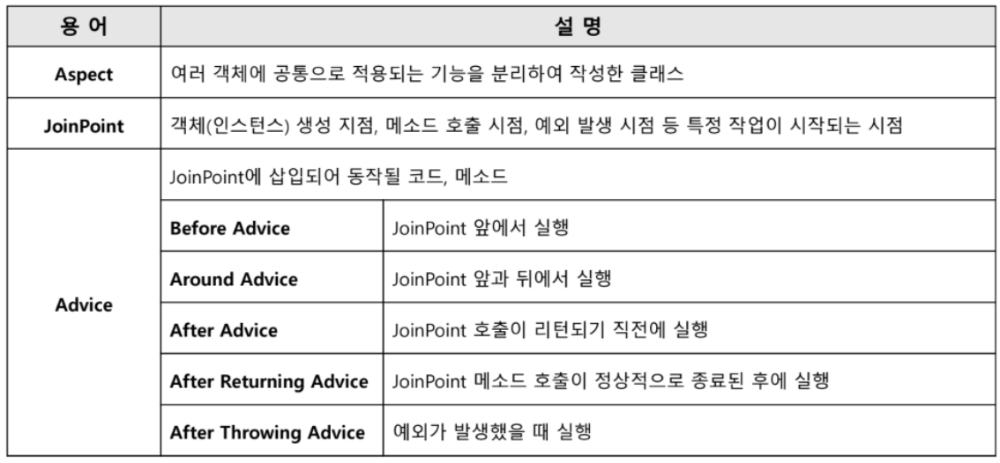
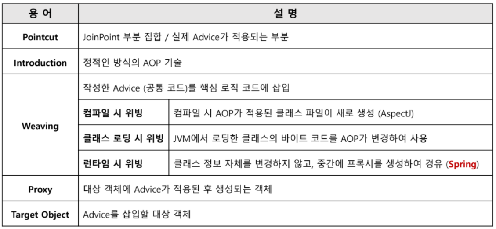
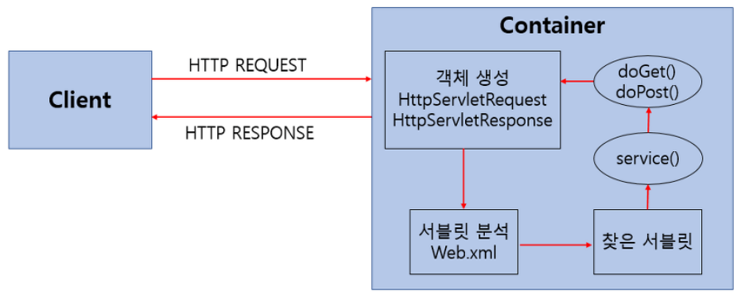

## 1. DI

개발 상황에서 객체들은 서로 **의존**되어있을 수밖에 없다.<br>

### 그럼 DI란 무엇인가?

### DI : Depedency Injection. (의존관계 주입)

외부로부터 **의존성을 주입**하는 것을 말한다.<br>
여기서 **의존성**이란? `의존대상 B가 변하면, 그것이 A에 영향을 미친다.`

우리가 의존 관계를 공부하다 보면, **강한 결합**과 **약한 결합**에 대해 접하게 된다.<br>
이것들은 **유지보수성**에 직결되는데 어떻게 직결되는 것일까?

### 강한 결합이란?

어떠한 객체가 다른 객체에 강한 의존성을 가지고 있음을 의미한다.
아래 예시로 이해해보자.

```java
public class Person {
    private Chicken chicken;
    
    public Person(){
        this.chicken = new Chicken();
    }
    
    public void startEat() {
        chicken.eat();
    }
}

public class Chicken {
    public void eat() {
        System.out.println("치킨을 먹는다.");
    }
}
```

Person 클래스의 멤버 변수 타입으로 Chicken 클래스가 존재한다.<br>
이때,
1. Chicken 클래스가 없으면 Person 클래스를 정의할 수 없으며<br>
2. Chicken 클래스를 Pizza 클래스로 바꾸게 되면 Person 클래스의 코드 대부분을 수정해야 한다.

`즉, Person 클래스가 Chicken 클래스에 의존한다!`

이는 유지보수 면에서 좋지 않다.

### 그럼 약한 결합이란?

**인터페이스**를 사용하는 것이다.

```java
public interface Food {
    void eat();
}

public class Chicken implements Food {
    @java.lang.Override
    public void eat() {
        System.out.println("치킨을 먹는다.");
    }
}

public class Pizza implements Food {
    @java.lang.Override
    public void eat() {
        System.out.println("피자를 먹는다.");
    }
}

public class Person {
    private Food food;
    
    public Person(Food food){
        this.food = food;
    }
    
    public void startEat(){
        food.eat();
    }
}
```

이처럼 Food 인터페이스를 사용하면, Chicken과 Pizza object를 모두 Food 타입에 대입할 수 있다.<br>
즉, Person 클래스 내부적으로 코드의 변경이 일어날 필요가 없다.<br>
이는 유지보수 면에서 매우 좋다.

### 그럼 도대체 DI는 어떻게 구현되나?

1. 생성자 주입 ******권장
```java
@Service
public class UMC7thMember {
    private final UMCRepository umcRepository;
    
    @Autowired
    public UMC7thMember(final UMCRepository umcRepository){
        this.umcRepository = umcRepository;
    }
}
```

**객체가 생성될 때 필요한 의존성을 설정**하는 방식이다.<br>
이는 **객체의 불변성을 보장**해주기에 생성자 주입이 권장되는 이유이다.


2. setter 주입

```java
@Service
public class UMC7thMember {
    private final UMCRepository umcRepository;
    
    @Autowired
    public setUMC7thMember(final UMCRepository umcRepository){
        this.umcRepository = umcRepository;
    }
}
```

**생성자를 통해 의존성을 설정**하는 방식이다.<br>
이는 런타임에 의존성을 주입하기 때문에, 의존성이 없더라도 객체 생성이 가능하다.<br>
그러나 의존성을 주입받지 않은 상태에서 작동할 수 있으므로, **NullPointException 에러**가 발생할 수 있다.


3. 필드 주입

```java
@Service
public class UMC7thMember {
    @Autowired
    private final UMCRepository umcRepository;
}
```

**필드에 직접 의존성을 설정**하는 방식이다.<br>
이것 역시 런타임에 의존성을 주입하기 때문에, 의존성이 없더라도 객체 생성이 가능하다.<br>
코드는 깔끔하지만, **명시적으로 드러나는 의존성이 없기에 의존성 구조를 이해하기 어렵다.**

<br>
<br>

## 2. loC

아래 예시는 일반적으로 자바에서 객체를 생성하는 방식이다.
```java
UMC7thMember umc7thMember = new UMC7thMember();
```
즉, 객체를 생성하고 사용하는 작업을 개발자가 직접 제어하는 것이다.

### 개발자가 직접 객체를 생성하지 않고, 객체의 생성 및 관리를 외부에 위임한다면?

이것이 바로 IoC, 제어의 역전이다.

### IoC : Inversion of Control. (제어의 역전)

사용할 객체를 직접 생성하지 않고, 객체의 생성과 관리를 **외부에 위임**하는 것이다.<br>
여기서 **외부**란?  **"스프링 컨테이너"** 를 말한다.<br>
이렇게 객체의 관리를 컨테이너에 맡겨 제어권이 넘어간 것을 **제어의 역전**이라고 부른다.

### 그렇다면 왜 IoC를 사용할까?

1. 객체 간 결합도를 낮춘다.
2. 유연한 코드 작성이 가능하다.
3. 가독성이 좋다.
4. 코드의 중복을 방지한다.
5. 유지보수가 용이하다.


#### IoC를 통해 DI와 AOP가 가능해지고, 우리는 비즈니스 로직에만 집중할 수 있다.
#### 이러한 IoC를 통해서 달성할 수 있는 것이 바로 POJO이다.

### POJO란 무엇일까?

### POJO : Plain Old Java Object. (순수한 오래된 자바 객체)

**객체 지향적인 원리에 충실**하면서 **환경과 기술에 종속되지 않고**, **필요에 따라 재활용**될 수 있도록 설계된 객체이다.<br>
이를 이용하여 프로그래밍 코드를 작성하는 것이 **POJO 프로그래밍**이다.

### POJO 프로그래밍이라고 하기 위해 지켜야하는 규칙

1. Java나 Java의 스펙에 정의된 것 이외에는 다른 기술이나 규약에 얽매이지 않아야 한다.
2. 특정 환경에 종속적이지 않아야 한다. 즉, 독립적이어야 한다는 소리이다.

### POJO 프로그래밍을 해야하는 이유가 있을까?

1. 특정 환경이나 기술에 종속적이지 않으면 재사용이 가능하고 확장 가능한 유연한 코드 작성이 가능하다.
2. 코드가 간결해지며 디버깅에도 유리하다.
3. 객체지향적인 설계를 제한없이 적용할 수 있다.


<br>
<br>


## 3. 프레임워크와 API의 차이

### 프레임워크란 무엇일까?

**어떠한 목적을 쉽게 달성할 수 있도록 해당 목적과 관련된 코드의 뼈대를 미리 만들어둔 것**과 같다.<br>
우리는 프레임워크에 의존하여 개발하고, 프레임워크가 정의한 규칙을 준수해야 한다.<br>
즉, **프레임이라는 뼈대 위에서 프로그램을 개발**하는 것이다.

### API란 무엇일까?

### API : Application Programming Interface

**2개 이상의 소프트웨어 컴포넌트 사이에서 상호작용할 수 있도록 정의된 인터페이스**를 말한다.<br>
즉, 응용 프로그램을 만드는데 필요한 **연결 장치 또는 매개체**라고 생각하면 된다.<br>
API가 필요한 이유는? 개발을 할 때 모든 것을 혼자 개발할 수는 없기 때문에.

### 프레임워크 vs API

한마디로 정의해보자면,

### 프레임워크는 프레임워크가 나를 호출하는 방식이고,
### API는 내가 API를 호출하는 방식이다!

<br>
<br>

## 4. AOP

### AOP : Aspect Oriented Programming (관점 지향 프로그래밍)

부가 기능을 핵심 기능에서 분리해 한 곳으로 관리하도록 하고, 이 부가 기능을 어디에 적용할지 선택하는 기능을 합한 하나의 모듈이다.<br>
즉, 흩어진 관심사를 Aspect로 모듈화하고 핵심적인 비즈니스 로직에서 분리하여 재사용하겠다는 것이 AOP의 취지이다.

### AOP 용어 정리




### AOP의 적용 방식

- 컴파일 시점
- 클래스 로딩 시점
- 런타임 시점 (프록시 사용)

컴파일 시점과 클래스 로딩 시점에는 AspectJ 프레임워크를 직접 사용해야 해서 번거롭다.<br>
따라서, 주로 런타임 시점 적용 방식을 사용하는 스프링 AOP를 사용한다.

스프링 AOP를 적용하기 위해서는 @Aspect 애노테이션을 작성해야 한다.
아래 예시를 참고하자.
```java
@Aspect
public class LogTraceAspect {
    @Around("execution(* hello.proxy.app..*(..))")
    public Object execute(ProceedingJoinPoint joinPoint) {
        ...
    }
}
```

** 스프링 AOP 적용 시에는 private, final 메소드는 AOP 적용이 불가하다. **

<br>
<br>

## 5. 서블릿

### Servlet

웹 애플리케이션에서 **클라이언트의 요청을 처리하고, 그에 대한 응답을 생성**하는 중요한 구성 요소이다.<br>
즉, **HTTP 요청을 처리**하는 역할을 한다.

아래 사진을 통해 서블릿에 대해 자세히 알아보자.


1. 클라이언트가 URL을 입력하면 HTTP Request가 Servlet Container로 전송한다.
2. 전송받은 Servlet Container는 HttpServletRequest, HttpServletResponse 객체를 생성한다.
3. web.xml을 기반으로 사용자가 요청한 URL이 어느 Servlet에 대한 요청인지 찾는다.
4. 해당 Servlet에서 service() 메소드를 호출하고, 클라이언트의 GET, POST 여부에 따라 doGet() 또는 doPost()를 호출한다.
5. 이 메소드들은 동적 페이지를 생성한 후, HttpServletResponse 객체에 응답을 보낸다.
6. 응답이 끝나면 HttpServletRequest, HttpServletResponse는 소멸시킨다.

### 그럼 여기서 Servlet Container는 무엇인가?

Servlet을 관리해주는 컨테이너이다.<br>
이는 클라이언트의 요청을 받아주고 응답할 수 있도록 웹 서버와 소켓으로 통신한다.

#### 추가적인 역할

1. Servlet 생명주기 관리
2. 멀티스레드 지원 및 관리
3. 선언적인 보안 관리

### Servlet 중 가장 중요한 것은?

### DispatcherServlet.

모든 HTTP protocol로 들어오는 요청을 가장 먼저 받아 적합한 컨트롤러에 위임해주는 front controller이다.

#### 장점

과거에는 모든 Servlet을 URL 매핑을 위해 web.xml에 모두 등록해주어야 했지만, DispatcherServlet이 해당 애플리케이션에 들어오는 모든 요청을 핸들링해주고 공통 작업을 처리하면서 상당히 편리하게 이용 가능해졌다.<br>
즉, 우리는 컨트롤러를 구현해두기만 하면 DispatcherServlet이 알아서 적합한 컨트롤러로 위임을 해주는 구조이다.

#### 동작 과정

아래 코드를 참고하며 살펴보자.
```java
@Controller
public class MyController {
    @GetMapping("/umc")
    public String hello(Model model){
        model.addAttribute("message", "UMC Spring Fighting!");
        return "greeting";
    }
}
```

1. 클라이언트가 '/umc' URL로 Http Request가 들어오면, 이는 DispatcherServlet으로 전달된다.
2. DispatcherServlet은 해당 요청을 처리할 수 있는 적합한 controller를 찾는다. >> **Handler Mapping**
3. controller는 요청 처리를 위해 hello() 메소드를 호출하고, 맞는 비즈니스 로직을 실행한 후 결과를 반환한다.
4. 이 결과는 **ViewResolver**를 통해 적절한 View로 렌더링하고, Http Response로 HTML이나 JSON의 형태로 전달된다.


