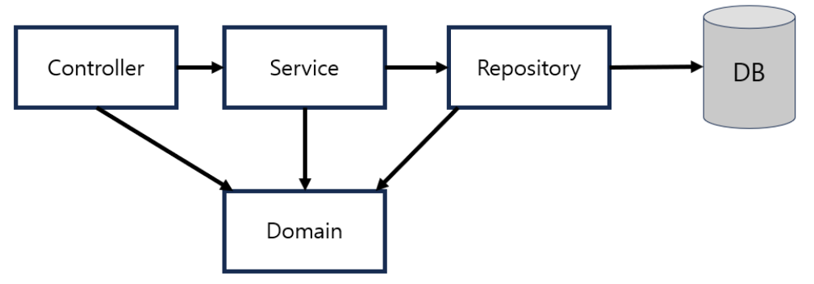

## 1. Domain

**해결하고자 하는 문제의 영역**을 도메인이라고 한다.<br>
쉽게, **요구사항이나 문제 영역** 등을 예시로 들 수 있다.<br>
도메인은 주로 애플리케이션의 핵심 비즈니스 로직이나 데이터를 표현하는 객체들을 의미하며, '도메인 객체' 또는 '도메인 모델'이라고도 불린다.

### 도메인 객체의 특징

1. 비즈니스 로직을 캡슐화한다.
2. 상태(변수)와 동작(메서드)을 함께 가진다.
3. 데이터베이스의 테이블과 매핑되어 ORM 프레임워크를 통해 데이터를 저장하거나 불러올 수 있다.<br>
이는 엔티티로 정의되어 데이터베이스와 직접 연동이 가능하다.

### 도메인 객체와 관련된 개념

1. **entity** : 고유한 식별자를 갖는 도메인 객체이다. 보통 데이터베이스의 테이블에 매핑된다.
2. **value object** : 고유 식별자가 필요하지 않고, 다른 객체에 포함되는 데이터 객체이다.
3. **aggregate** : 비즈니스적으로 밀접하게 관련된 entity와 value의 모음이다.

그렇다면, **웹 애플리케이션 계층 구조에서의 domain**은 무엇일까?



**Domain** : 엔티티 선언을 통해 DB에 저장되는 객체들을 구현한다.<br>
즉, 테이블의 각 column들이 하나의 도메인이라고 볼 수 있다.

예시 코드를 봐보자.

```java
public class Member {
    private Long id;
    private String name;
    
    public Long getId() {
        return id;
    }
    
    pbulic void setId(Long id) {
        this.id = id;
    }
    
    public String getName() {
        return name;
    }
    
    public void setName(String name) {
        this.name = name;
    }
}
```

<br>
<br>

## 2. 양방향 매핑

테이블 간의 연관 관계 매핑에는 단방향 매핑과 양방향 매핑이 있다.<br>
양방향 매핑을 공부하기 전에 단방향 매핑에 대해 간단히 짚고 넘어가자.

### 단방향 매핑이란?

**연관 관계 주인에게만 연관 관계를 주입**하는 것이다.<br>
그렇다면 여기서 연관 관계 주인이란 무엇일까?

### 연관 관계 주인

실제 데이터베이스에서 외래키를 가지는 엔티티, 즉 테이블을 의미한다.

### 연관 관계 주인 설정은 어떻게?

<단방향 매핑의 경우>
- **1:N**의 경우 : N에 해당하는 테이블이 외래키를 가지며 N에 해당하는 엔티티를 주인으로 설정한다.
- **1:1**의 경우 : 둘 중 하나만 외래키를 가지면 되기에 원하는 엔티티를 주인으로 설정한다.

이때, N:1에서 N에 해당하는 엔티티가 1에 해당하는 엔티티와 연관 관계를 매핑할 때 사용하는 어노테이션은 무엇일까?

### @ManyToOne과 실제 데이터베이스에서 해당 외래키의 이름을 설정하는 @JoinColumn.

<br>

그렇다면 이제 양방향 매핑에 대해 알아보자.

### 양방향 매핑이란?

**연관 관계 주인이 아닌 엔티티에게도 연관 관계를 주입**하는 것이다.

<양방향 매핑의 경우>
- **1:N**의 경우 : 1에 해당하는 엔티티에게 설정한다.

이때 사용하는 어노테이션은

### @OneToMany(mappedBy=" ", -) 이다.

이는 1에 해당하는 엔티티가 N에 해당하는 엔티티와 관계가 있음을 명시한다.<br>
N에 해당하는 엔티티에서 ManyToOne이 설정된 멤버변수를 mappedBy한다.

### 양방향 매핑의 장점은 뭘까?

- 양방향 매핑으로 인한 객체 그래프 탐색이 프로그래밍을 굉장히 편리하게 해준다.
- cascade의 설정이 가능하다.

### cascade란?

**참조 대상인 테이블의 칼럼이 삭제될 때 같이 삭제되거나 변경이 될 때 같이 변경이 되는 기능**이다.<br>
이는 JPA에서 연관관계의 주인이 아닌, 참조의 대상이 되는 엔티티에 설정하여 사용 가능하다.<br>
> 즉, 단방향 매핑 만으로는 cascade 설정을 하는 것에 문제가 있다는 것이다.

단, 양방향 매핑을 할 경우 연관 관계 편의 메서드가 필요하다.

### 연관 관계 편의 메서드란?

연관 관계를 설정하는 메서드이다.<br>
예시로 이해해보자.

```java
// 일반적인 코드
member.setTeam(team);
team.getMembers().add(member);

// 연관 관계 편의 메서드를 사용한 코드
public void setTeam(Team team){
    this.team = team;
    team.getMembers().add(this);
}
```

양방향 매핑에서는 따로따로 사용하다가 한 줄을 넣지 않아 둘 중 하나만 호출이 되어 양방향이 깨지는 상황을 대비하여 두 코드를 하나의 것처럼 사용하는 것이 안전하다.

### 양방향 매핑의 문제점

1. **순환 참조 문제**
- 양방향 매핑은 순환 구조를 만들어, 객체가 서로를 참조하는 무한 루프에 빠질 수 있다.
- 이로 인해 예외가 발생할 수 있으며, 이 문제를 방지하려면 별도의 로직이나 설정이 필요하다.
2. **데이터 일관성 문제**
- 양방향 매핑은 양쪽의 데이터가 항상 일치해야 한다.
- 한 쪽의 엔티티에서 수정하면 다른 쪽에서도 동일한 변경이 이루어져야 하므로, 이를 위한 추가적인 코드가 필요하다.
- 이 과정을 처리하지 않는다면 데이터 불일치가 발생할 수 있다.

<br>
<br>

## 3. N + 1 문제

ORM 기술에서 특정 객체를 대상으로 수행한 쿼리가 해당 객체가 가지고 있는 **연관관계 또한 조회하게 되면서 N번의 추가적인 쿼리가 발생**하는 문제를 말한다.

### 왜 발생할까?

**관계형 데이터베이스와 객체지향 언어간의 패러다임 차이**로 인해 발생한다.<br>
객체는 연관관계를 통해 레퍼런스를 가지고 있으면 언제든지 메모리 내에서 Random Access를 통해 연관 객체에 접근할 수 있지만, RDB의 경우 Select 쿼리를 통해서만 조회할 수 있기 때문.

### N+1 문제를 Eager Loading으로 해결할 수 있을까?

부분적으로 해결해줄 수는 있겠지만, **권장하지 않는다.**<br>
그럼 여기서 말하는 Eager Loading은 뭘까?

### Eager Loading

**연관된 entity 객체를 한 번에 조회하도록 하는 기능**이다.<br>
이를 사용한다면, 어떤 entity 연관 관계 범위까지 join 쿼리로 조회해올지 예상하기 어려워 필요없는 데이터까지 로딩하여 비효율적일 수 있다.<br>

그럼 N+1 문제를 해결하기 위한 방법에는 뭐가 있을까?

### Fetch Join + Lazy Loading

Root entity에 대해서 조회할 때 Lazy Loading으로 설정되어 있는 연관 관계를 join 쿼리를 발생시켜 한 번에 조회할 수 있는 기능이다.<br>

#### Fetch Join vs 일반 Join

Fetch Join은 ORM에서의 사용을 전제로 DB Schema를 entity로 자동 변환 해주고 영속성 컨텍스트에 영속화해준다.<br>

- **Fetch Join으로 조회** : 연관 관계는 영속성 컨텍스트 1차캐시에 저장되어 다시 entity 그래프를 탐색하더라도 조회 쿼리가 수행되지 않는다.
- **일반 Join으로 조회** : 단순히 데이터를 조회하는 개념으로 영속성 컨텍스트나 entity와는 무관하다.

따라서, Fetch Join을 활용하면 ORM 활용이 가능하여 RDB와의 패러다임 차이를 줄일 수 있다.

#### Collection 연관 관계 Fetch Join 시 주의사항

Collection에 대해서 Fetch Join을 할 경우, 1:N 관계이기에 1쪽의 데이터는 중복된 상태로 조회된다.<br>
이를 방지하려면? distinct 절을 활용해야한다. >> 중복되는 entity 제거 가능.

### Lazy Loading

**데이터가 실제로 필요할 때까지 로드하지 않고 대기하는 기법**이다.<br>
즉, 객체나 리소스를 미리 로드하지 않고, 사용자가 요청하거나 액세스할 때 로드하는 방식이다.
> 데이터베이스에서 관련 entity를 가져올 때, 연관된 모든 데이터를 처음부터 다 가져오는 대신 실제로 접근할 때까지 대기.

#### 장점

1. 사용하지 않는 데이터를 메모리에 로드하지 않으므로, 메모리를 절약할 수 있다.
2. 필요한 데이터만 가져오므로, 초기 응답 시간이 줄어들 수 있다.
3. 트랜잭션 처리 시간을 최적화할 수 있다.

#### 단점

1. Lazy Loading을 부적절하게 사용하면 N+1 문제가 발생할 수 있다.
2. 코드가 복잡해질 수 있으며, 어느 시점에 데이터가 로드되는지 예측하기 어렵다.
3. 트랜잭션 경계를 벗어나 데이터를 로드하려고 하면 오류가 발생할 수 있다.

### default_batch_fetch_size, @BatchSize

이러한 Lazy Loading 시 프록시 객체를 조회할 때 where in 절로 묶어서 한 번에 조회할 수 있게 해주는 옵션이다.<br>
yml에 전역 옵션으로 적용할 수도 있으며, @BatchSize를 통해 연관 관계 BatchSize를 다르게 적용할 수도 있다.

### Fetch Join vs BatchSize

Collection Fetch Join 시 paging 문제나 1개까지만 Fetch Join을 할 수 있다는 한계들을 BatchSize는 해결할 수 있다.

### 만약, 많은 컬럼 중 특정 컬럼만 조회해야 하는 경우나 커버링 인덱스를 활용하고 싶은 경우 데이터 전송량을 줄이고 싶다면?

일반 Join을 하고 Projection하여 Dto로 변환하여 조회하는 방법이 있다.<br>
이 방식을 사용하는 쿼리는 DAO를 분리하는 것이 좋다.