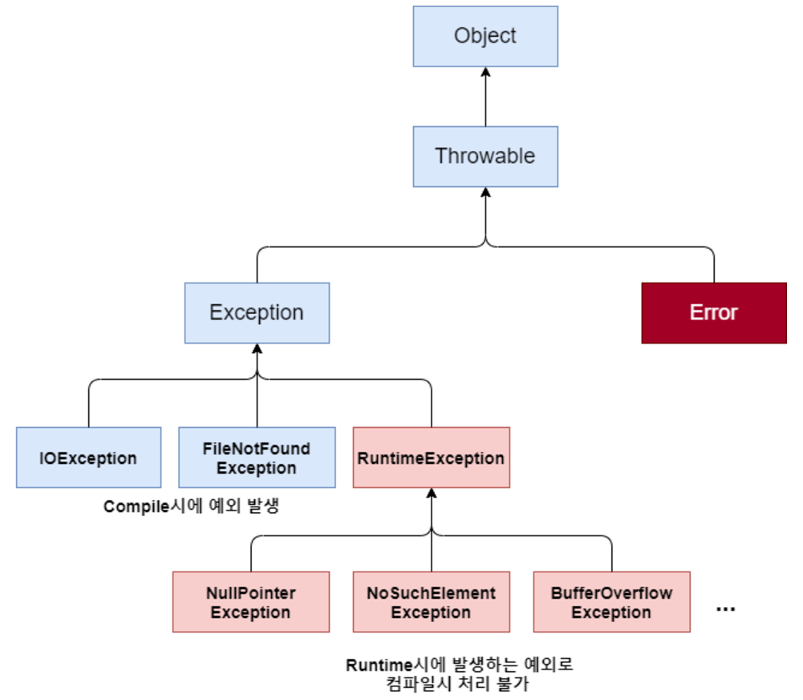

## 1. java의 Exception 종류들

### 에러 vs 예외

**에러** : 컴퓨터 하드웨어의 오작동 또는 고장으로 인해 응용프로그램 실행 오류가 발생하는 것. 
**예외** : 사용자의 잘못된 조작 또는 개발자의 잘못된 코딩으로 인해 발생하는 프로그램 오류.

예외가 발생되면 프로그램은 곧바로 종료된다는 점에서 에러와 동일하다. 
>그러나, **예외는 예외처리를 통해 프로그램을 종료하지 않고 정상 실행 상태를 만드는 것이 가능**하다.

### 일반 예외 (Exception)

일반 예외는 컴파일 체크 예외라고도 할 수 있다.
자바 소스를 컴파일하는 과정에서 예외 처리 코드가 필요한지 검사하기 때문.

### 실행 예외 (Runtime Exception)

컴파일하는 과정에서 예외코드를 검사하지 않는 예외이다.

> 이 두가지 방법은 컴파일 시 예외 처리를 확인하는 차이일 뿐, **두가지 예외 모두 예외 처리가 필요**하다.

### 일반 예외 vs 실행 예외

- 일반 예외 : Exception을 상속받지만 RuntimeException은 상속받지 않는 클래스.
- 실행 예외 : Exception을 상속받지만 Exception을 상속받은 java.lang.RuntimeException을 상속받는 클래스.

### 실행 예외의 종류들

#### 1. NullPointerException
객체 참조가 없는 상태, 즉 null 값을 가지고 있는 참조 변수로 객체 접근 연산자인 도트(.)를 사용했을 때 발생한다. 
즉, 객체가 없는 상태에서 객체를 사용하려 하는 경우에 발생한다고 생각하면 된다.

#### 2. ArrayIndexOutOfBoundException
배열에서 할당된 배열의 인덱스 범위를 초과해서 사용하는 경우 발생하는 예외이다.

#### 3. NumberFormatException
문자열로 되어있는 데이터를 숫자로 변경하는 경우에, 매개변수로 오는 문자열이 숫자로 변환되지 않는 값이라면 예외가 발생한다.

#### 4. ClassCastException
상위 클래스와 하위 클래스간 또는 구현 클래스와 인터페이스 간에 발생하는 타입 변환이 아닌 경우에 억지로 타입 변환을 시도할 경우 발생하는 예외이다.

#### 5. ArithmeticException
정수를 0으로 나눌 때 발생하는 예외이다.

#### 6. InputMismatchException
의도치 않은 입력 오류 시 발생하는 예외이다.

### 일반 예외의 종류들

#### 1. IOException
입력과 출력을 다루는 메소드에 예외처리가 없다면 컴파일 에러가 발생할 수 있다.

#### 2. FileNotFoundException
파일에 접근하려고 하는데 파일을 찾지 못하였을 때 발생하는 예외이다.

 
 

## 2. @Valid

**빈 검증기를 이용해 객체의 제약 조건을 검증하도록 지시하는 어노테이션이**다. 
@Valid는 기본적으로 컨트롤러에서만 동작하며, 다른 계층에서는 검증이 되지 않는다. 
다른 계층에서 검증하기 위해서는 @Validated를 사용해야 한다. 
만약 유효성 검증에 실패할 경우, MethodArgumentNotValidException이 발생한다.

### 유효성 검증 방법

1. Controller의 메소드에 @Valid 붙이기.
2. 유효성 검사를 할 필드에 붙이기.

> @Valid에 의한 반환값은 400 BadRequest이므로, 이를 결과로 해당 제약 조건들이 정상적으로 검증되는지를 예측하면 된다.

### 그럼 이 유효성 검사는 Controller, Service, Dto, Entity 중 어디서 해야할까?

1. Controller에서 @Valid를 통해, Entity 수준에서 유효성 검사를 한다.
2. Controller에서 @Valid를 통해, Dto 수준에서 유효성 검사를 한다.

> 위 두가지 방법은 특정 레이어에서만 유효성 검사를 실시하기에, 이러한 경우 DB에 원하는 값이 들어가지 않는 경우가 생긴다.

**모든 레이어에서 유효성 검사의 책임을 갖도록 하자.**

### 다양한 제약 조건 어노테이션

- @NotNull : 해당 값이 null이 아닌지 검증.
- @NotEmpty : 해당 값이 null이 아니고, 빈 스트링이 아닌지 검증.
- @NotBlank : 해당 값이 null이 아니고, 공백이 아닌지 검증.
- @AssertTrue : 해당 값이 true인지 검증
- @Size : 해당 값이 주어진 값 사이에 해당하는지 검증.
- @Min : 해당 값이 주어진 값보다 작지 않은지 검증.
- @Max : 해당 값이 주어진 값보다 크지 않은지 검증.
- @Pattern : 해당 값이 주어진 패턴과 일치하는지 검증.

