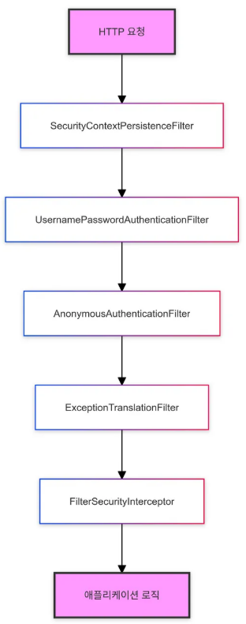

## 1. Spring Security

Spring 기반 애플리케이션의 보안을 담당하는 강력한 프레임워크. 
이 프레임워크는 웹 애플리케이션과 RESTful API의 보안을 관리하는 데 사용되며, **인증과 권한 부여 그리고 다양한 보안 기능**을 지원한다.

### 주요 컴포넌트

1. AuthenticationManager
- **인증 과정을 관리하는 중심 컴포넌트.**
- 사용자가 로그인을 시도할 때, `AuthenticationManager`가 사용자의 자격 증명을 받아 이를 인증할 수 있는 프로세스를 호출한다.

2. AuthenticationProvider
- **실제로 인증 로직을 처리하는 컴포넌트.**
- 여러 `AuthenticationProvider` 존재 가능.

3. UserDetailsService
- **사용자 정보를 불러오고 검증하는 서비스.**
- 데이터베이스 또는 다른 저장소에서 사용자 정보를 가져오고 이를 `UserDetails` 객체로 반환.

4. SecurityContext
- **인증이 완료된 사용자 정보를 저장하는 컨텍스트.**
- `SecurityContextHolder`를 통해 접근 가능하며 이 정보는 애플리케이션 전반에서 공유.

### SecurityContextHolder

1. 인증된 사용자 정보를 `SecurityContext`에 저장 및 관리.
2. 이후의 요청에서 `SecurityContext`를 통해 인증된 정보를 참조하여 사용자의 권한이나 인증 상태 확인.
3. 애플리케이션의 어디서나 `SecurityContextHolder.getContext()` 메서드를 사용해 인증 정보 접근.

### Filter Chain

Spring Security에서 Http 요청을 처리할 때 사용하는 일련의 필터들. 
이 필터들을 순차적으로 통과해야 한다.

1. SecurityContextPersistenceFilter
- 요청 간 SecurityContext를 유지.
- 새 요청이 들어올 때 이전에 인증된 사용자의 정보를 복원.

2. UsernamePasswordAuthenticationFilter
- 폼 기반 로그인 처리.
- 사용자가 제출한 username과 password를 확인하여 인증 시도.

3. AnonymousAuthenticationFilter
- 이전 필터에서 인증되지 않은 요청에 대해 익명 사용자 인증 제공.

4. ExceptionTranslationFilter
- Spring Security 예외를 Http 응답으로 변환.
- 인증 실패 시 로그인 페이지로 리다이렉트하거나 인가 실패 시 403 오류를 반환.

5. FilterSecurityInterceptor
- 접근 제어 결정을 내리는 마지막 필터.
- 현재 인증된 사용자가 요청한 리소스에 접근할 권한이 있는지 확인.

### Filter Chain 동작 방식

 
 

## 2. 인증(Authentication)과 인가(Authorization)

### 1) 인증(Authentication) 이란?

**사용자가 누구인지 확인하는 과정.** 
즉, 사용자가 제공한 자격 증명을 통해 사용자가 누구인지를 확인하는 것이다.

### 인증 흐름

1. 사용자 로그인 요청
2. `AuthenticationFilter`가 요청을 가로채고 `Authentication` 객체 생성.
3. `AuthenticationManager`가 적절한 `AuthenticationProvider`를 선택하여 인증 위임.
4. 선택된 `AuthenticationProvider`가 `UserDetailsService`를 사용해 사용자 정보 로드 및 로드된 정보를 바탕으로 비밀번호 검증.
5. 데이터베이스나 다른 저장소에서 사용자 정보를 조회.
6. 인증이 성공하면, `Authentication` 객체가 `SecurityContext`에 저장.

### 2) 인가(Authorization) 란?

**인증된 사용자가 시스템 내에서 어떤 자원에 접근할 수 있는지, 어떤 작업을 수행할 수 있는지 결정하는 과정.**  
> 즉, **권한 부여** !!

보통 관리자는 모든 자원에 접근할 수 있지만 일반 사용자는 특정 자원에만 접근 가능하다. 

### 인가 흐름

1. 인증된 사용자가 리소스 접근 요청.
2. `FilterSecurityInterceptor`가 요청을 가로채고 권한 검사 시작.
3. `AccessDecisionManager`가 현재 사용자의 권한과 요청된 리소스의 필요 권한 비교.
4. `SecurityContext`에서 현재 인증된 사용자의 권한 정보 조회.
5. 사용자 권한이 충분하면 리소스 접근 허용, 권한이 부족하면 `AccessDeniedException`이 발생하고 접근 거부.

### 인증 vs 인가

- 인증 후에 인가가 이루어진다.
- 인증은 사용자가 시스템에 접근할 수 있는지 여부를 판단하는 것이고,
- 인가는 인증된 사용자가 접근할 수 있는 자원과 작업을 결정하는 것이다.

 

- 인증은 `AuthenticationManager`를 사용하여 사용자 인증을 처리한다.
- 사용자가 입력한 자격 증명을 `UserDetailsService`를 통해 데이터베이스나 메모리에서 검증한다.

 

- 인가는 인증 후, `@PreAuthorize`와 같은 어노테이션이나 `HttpSecurity` 설정을 통해 사용자가 어떤 리소스에 접근할 수 있는지, 어떤 권한을 가져야 하는지 설정 가능하다.
