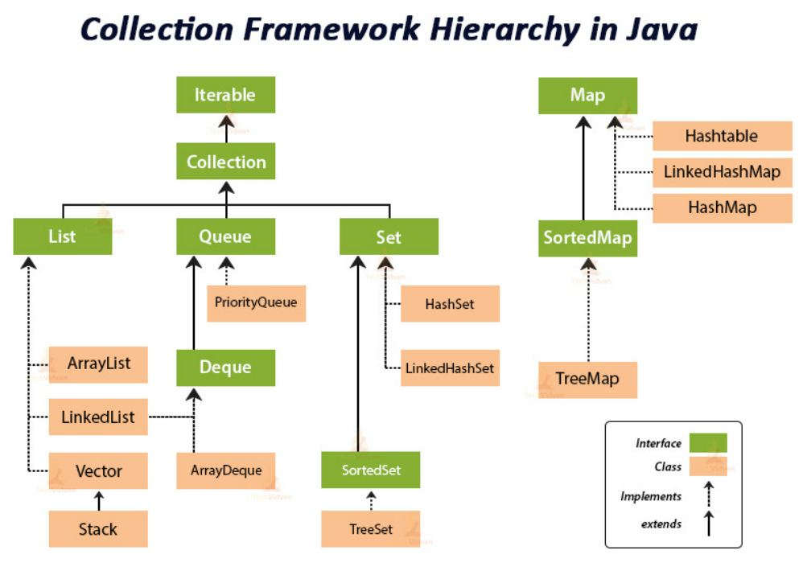

## 1. static

### '고정된' 이라는 뜻으로, 클래스를 사용하는 내내 고정되어 있는 변수라면 static을 붙여 클래스 변수로 사용한다.

<br>

- static이 붙어있다면 클래스 변수, 붙어있지 않다면 인스턴스 변수.

|        |선언 위치|   선언 방법    |  생성 시기   |
|:------:|:------:|:----------:|:--------:|
|인스턴스 변수|클래스 영역| - | 인스턴스 선언시 |
|클래스 변수|클래스 영역| static을 붙임 | 클래스 선언시  |
|지역 변수|메서드 내부|-|메서드 호출시|

<br>

```java
class Person {
    int age;
    static String name;

    void move() {
        int l = 0;
        System.out.println(name + " is moving" + l);
    }
}

class Main {
    public static void main(String[] args) {
        Person.name = umc;
        Person.move();

        Person person = new Person();
        person.age = 22;
        
        System.out.println("She is " + age + " years old.";
    }
}
```

- static 이 붙은 변수 or 메서드 사용 시<br>
  &emsp; 클래스명.변수;<br>
  &emsp; 클래스명.메서드();<br>
  <br>
- static 이 붙지 않은 변수 or 메서드 사용 시<br>
  &emsp; 클래스명 참조변수;<br>
  &emsp; 참조변수 = new 클래스명;<br>
  &emsp; 참조변수.변수;<br>
  &emsp; 참조변수.메서드();

<br>

## 2. JVM 메모리

### JVM이란 Java Virtual Machine의 약자로, OS에 종속받지 않고 CPU가 Java를 인식 및 실행할 수 있게 하는 가상 컴퓨터이다.

- 운영체제에 종속적이며, 자바와 운영체제 사이의 매개체이다.
- stack 기반으로 가비지 컬렉터를 사용한 메모리 관리도 자동으로 수행한다.

#### JVM은 OS에서 메모리 영역을 할당받는데, 이는 heap, stack, method(static) 영역으로 구분된다.

- 변수나 메서드에 static 키워드가 붙으면 컴파일러에 의해 우선적으로 method 영역 메모리에 할당된다.
- method 영역은 가비지 컬렉터가 관여하지 않기에, 이 영역에 할당된 데이터는 시스템이 종료될 때까지 유지된다.

<br>

## 3. ClassLoader

### JVM의 구성요소 중 하나로, '.class' 바이트 코드를 읽어 들여 class 객체를 생성하는 역할을 담당한다.

즉, **클래스가 요청될 때 class 파일로부터 바이트 코드를 읽어 메모리로 로딩하는 역할**이다.

- 자바 클래스들은 한 번에 모든 클래스가 메모리에 올라가지 않는다.
- 각 클래스들은 필요할 때 애플리케이션에 올라가게 되며, 이 작업을 ClassLoader가 해준다.
- 클래스가 처음 ClassLoader에 의해 메모리에 로드될 때, 그 클래스의 static 변수 및 메서드도 함께 로드된다.

#### ClassLoader의 종류

- Bootstrap ClassLoader : JDK의 기본 클래스를 로드한다.
- Extension ClassLoader : JDK의 확장 클래스를 로드한다.
- Application ClassLoader : 애플리케이션 클래스 경로에 있는 클래스를 로드한다.

<br>

## 4. Collection Interface

Collection Interface를 이해하기 위해서 Collection Framework가 무엇인지 알고가자.

### Collection Framework란?

#### 데이터 객체를 저장하는 클래스들을 표준화한 설계이다.

- 다수의 데이터를 다루는 데 필요한 다양하고 풍부한 클래스들을 제공하기에, 일일히 구현할 필요없이 프레임워크를 가져와 사용할 수 있다.
- 오직 객체만을 저장할 수 있기 때문에 int, double과 같은 primitive 타입은 저장할 수 없다.<br> >> wrapper 타입으로 변환하여 Integer, Double 객체로 박싱하여 저장.

#### Collection Framework의 장점

- 인터페이스와 다형성을 이용한 객체지향적인 설계를 통해 표준화되어, 사용법을 익히기 편리하고 재사용성이 높은 코드 작성이 가능하다.
- 이미 구현된 API를 사용하므로, 새로운 API를 익히고 설계하는 시간이 줄어든다.



<br>

### 그럼 Collcetion Interface란 뭘까?

#### List, Set, Queue에서 공통으로 사용하는 메서드를 모아 선언해놓은 인터페이스이다.

- List, Set, Queue를 상속하는 실질적 최상위 컬렉션 타입으로, 이 세 가지 인터페이스들은 업캐스팅으로 다양한 종류의 컬렉션 자료형을 받아 삽입, 삭제, 탐색이 가능하다.

```java
public interface Collection<E> extends Iterable<E> {
 
    int size(); // Collection에 저장된 객체의 개수 리턴
 
    boolean isEmpty(); // Collection이 비어있는지 확인
 
    boolean contains(Object o);  
    boolean containsAll(Collection<?> c); // 지정된 객체나 Collection의 객체들이 포함되어 있는지 확인
 
    Object[] toArray(); // Collection에 저장된 객체를 객체 배열(Object[])로 리턴
    <T> T[] toArray(T[] a); // 지정된 배열에 Collection의 객체를 저장해서 리턴
    default <T> T[] toArray(IntFunction<T[]> generator) {
        return toArray(generator.apply(0));
    }
 
    boolean add(E e); 
    boolean addAll(Collection<? extends E> c); // 지정된 객체나 Collection의 객체들을 추가
 
    boolean remove(Object o); 
    boolean removeAll(Collection<?> c); // 지정된 객체나 Collection의 객체들을 삭제
 
    boolean retainAll(Collection<?> c); // 지정된 Collection에 포함된 객체만을 남기고 다른 객체들은 삭제하는데, 이 작업으로 인해 Collection의 변화가 생기면 true, else false return
 
    void clear(); // 컬렉션 초기화
 
    boolean equals(Object o); // 동일한 Collection인지 비교
 
    int hashCode(); // Collection의 hash code 리턴
 
    Iterator<E> iterator(); // Collection의 Iterator를 얻어서 리턴 (상위 Iterable 인터페이스를 상속)
 
    @Override
    default Spliterator<E> spliterator() { // 파이프라이닝 관련 메소드로 (상위 Iterable 인터페이스를 상속받아 구현) 
        return Spliterators.spliterator(this, 0);
    }
 
    default Stream<E> stream() { // JDK 1.8 ver.
        return StreamSupport.stream(spliterator(), false);
    }
 
    default Stream<E> parallelStream() { // JDK 1.8 ver. 
        return StreamSupport.stream(spliterator(), true);
    }
 
    default boolean removeIf(Predicate<? super E> filter) { // JDK 1.8 ver. 
        Objects.requireNonNull(filter);
        boolean removed = false;
        final Iterator<E> each = iterator();
        while (each.hasNext()) {
            if (filter.test(each.next())) {
                each.remove();
                removed = true;
            }
        }
        return removed;
    }
}
```