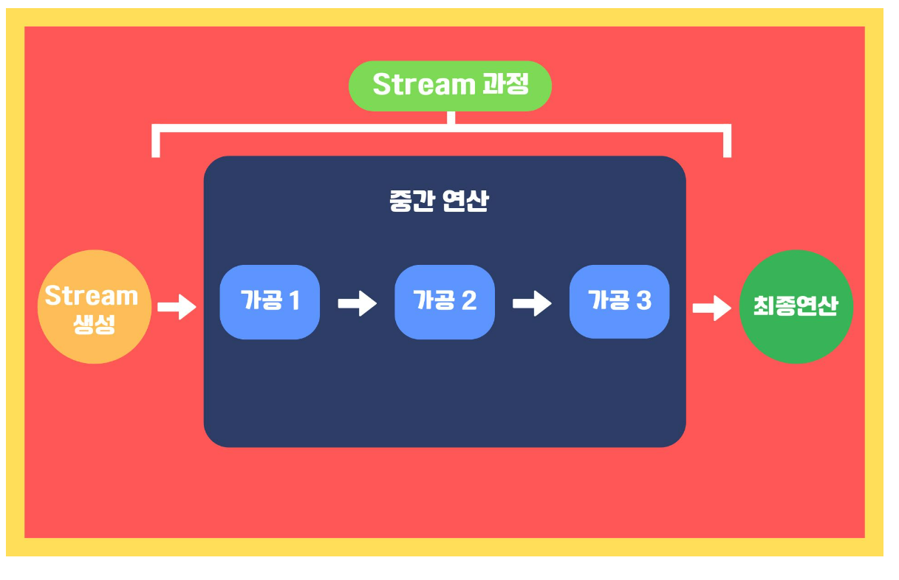

## 1. 함수형 인터페이스

**함수를 위한 인터페이스**로, 이 인터페이스를 구현한 클래스는 **하나의 함수처럼 동작**하게 된다.<br>
이는 static 메소드와 default 메소드가 아닌 추상 메소드를 딱 하나만 가져야 한다.<br>
함수형 인터페이스는 아래와 같이 사용할 수 있다.

```java
@FunctionalInterface
public interface Function<T, R>{
    
}
```

이 경우는 T라는 타입을 입력 받아 R이라는 타입을 출력한다.<br>
즉, `Function<String, Integer>`의 경우에는 String을 입력 받아 Integer를 출력한다고 볼 수 있다.

### 함수형 인터페이스 종류

|     함수형 인터페이스 이름      |               설명               |       추상 메소드        |
|:---------------------:|:------------------------------:|:-------------------:|
|    Function<T, R>     |       타입 T를 받아 타입 R을 반환        |    R apply(T t)     |
|      Consumer<T>      |          타입 T를 받아 소비           |  void accept(T t)   |
|      Supplier<T>      |            타입 T를 반환            |       T get()       |
|     Predicate<T>      |      타입 T를 받아 boolean을 반환      |  boolean test(T t)  |
|  BiFunction<T, U, R>  |      타입 T, U를 받아 타입 R을 반환      |  R apply(T t, U u)  |
|   UnaryOperator<T>    |       타입 T를 받아 타입 T를 반환        |          -          |
|   BinaryOperator<T>   |  동일한 타입의 입력값 두 개를 받아 동일 타입 반환  |          -          |

크게 4개만 살펴보자.

#### Function<T, R>

주로 T 타입의 객체를 받아 다른 형태 R로 변환하는데 사용된다.<br>
이 메소드를 호출할 때 생성자 참조 방식을 이용해서 정수 값을 문자열로 변환하고 변환된 문자열을 출력한다.
```java
public static void print(Function<Integer, String> function, int value) {
    System.out.println(function.apply(value));
}

// 메소드 호출
print(Object::toString, 5);
// 출력 : 5
```

#### Consumer<T>

한 개의 입력을 받아서 결과를 반환하지 않는 함수를 정의한다.<br>
주로 입력값을 이용한 연산이나 출력 등의 동작에 사용된다.
```java
public static void printList(Consumer<String> consumer, List<String> list) {
    for (String item : list) {
        consumer.accept(item);
    }
}

// 메소드 호출
printList(System.out::println, Arrays.asList("Apple", "Banana", "Cherry"));
// 출력: 
// Apple
// Banana
// Cherry
```

#### Supplier<T>

입력 없이 결과를 반환하는 함수를 정의한다.<br>
주로 파라미터 없이 특정 결과를 생성하는데 사용된다.
```java
public static void print(Supplier<String> supplier) {
    System.out.println(supplier.get());
}
 
// 메소드 호출
print(() -> "안녕하세요!");
// 출력: 안녕하세요!
```

위의 경우, 람다식을 이용해 문자열을 출력한다.

#### Predicate<T>

한 개의 입력을 받아서 boolean 결과를 반환하는 함수를 정의한다.<br>
주로 객체를 조건에 따른 필터링이 필요할 때 사용된다.
```java
public static void print(Predicate<Integer> predicate, int value) {
    if (predicate.test(value)) {
        System.out.println(value);
    }
}
 
// 메서드 호출
print(x -> x > 5, 10);  
// 출력: 10
```
위의 경우 역시, 람다식을 이용해 조건을 만족하면 value 값이 출력된다.

> AOP처럼 공통적인 기능을 한 곳에서 관리하고, 핵심 기능만을 분리할 수는 없는지 생각하다가, <br>**함수형 인터페이스를 사용해 함수로 추상화하여 재사용가능한 코드를 만들 수 있다!**

### 문제풀이

```java
import java.util.function.Function;

// Function 인터페이스를 상속받은 클래스
class ExFunction implements Function<Integer, String> {
    @Override
    public String apply(Integer integer) {
        return String.valueOf(integer);
    }
}

public class Main {
    public static void main(String[] args) {
        // 1. 익명클래스 정의
        Function<Integer, String> function1 = new Function<Integer, String>() {
            @Override
            public String apply(Integer integer) {
                return String.valueOf(integer);
            }
        };
        System.out.println(function1.apply(111)); // 출력: "111"

        // 2. 클래스 파일을 만들어 상속받아서 정의
        ExFunction function2 = new ExFunction();
        System.out.println(function2.apply(222)); // 출력: "222"

        // 3. 람다식으로 정의
        Function<Integer, String> function3 = integer -> String.valueOf(integer);
        System.out.println(function3.apply(333)); // 출력: "333"

        // 4. 메서드 참조로 정의
        Function<Integer, String> function4 = String::valueOf;
        System.out.println(function4.apply(444)); // 출력: "444"
    }
}
```

### 질문

Q. 람다식을 사용해서 함수형 인터페이스를 어떻게 간결하게 표현하고 람다식을 사용했을 때의 장점은 무엇이 있나요?
<br>
A. 익명 클래스를 사용한 경우를 예로 들면, 전통적인 방법인 오버라이드를 할 필요 없이 `integer -> String.valueOf(integer)`를 통해 간결하게 나타낼 수 있습니다.
<br>또한, 불필요한 클래스 정의와 메소드 오버라이드를 생략할 수 있어서 코드가 간결해지고 가독성이 올라갑니다.

<br>
<br>

## 2. stream api

데이터를 추상화하고, 처리하는데 자주 사용되는 함수들을 정의한다.<br>
여기서 **데이터를 추상화**한다는 것은? **데이터의 종류에 상관없이 같은 방식으로 데이터를 처리**할 수 있음을 의미한다.

#### 특징

1. 원본의 데이터를 변경하지 않는다.
2. Stream은 일회용이기 때문에 한 번 사용이 끝나면 재사용이 불가능하다.
3. 내부 반복으로 작업을 처리한다. 따라서 코드가 간결해진다.

#### 과정

1. Stream 생성
2. 중간 연산
3. 최종 연산

#### 장점

- 훨씬 간결해지고 명료해져서 소스코드의 가독성이 좋아진다.
- 코드를 직접 개발한 개발자가 아니어도 코드의 구조를 한눈에 알아보기 쉬워 유지보수 및 인수인계 시에도 어려움없이 작업이 가능하다.
- 병렬처리를 지원하기에 대량의 데이터를 빠르고 쉽게 처리할 수 있다.

### 문제풀이

```java
import java.util.Arrays;

public class ExStream {
    public static void main(String[] args) {
        int[] arr = {1,2,3,4,5,6,7,8,9,10};
        int[] doubledArr = Arrays.stream(arr)
                .map(x->x*2)
                .toArray();
        
        System.out.println("원본 배열 : " + Arrays.toString(arr));
        System.out.println("2배 배열 : " + Arrays.toString(doubledArr));
        
        String[] evenArr = Arrays.stream(arr)
                .filter(x->x%2==0)
                .map(x->x + "is even number")
                .toArray(String[]::new);
        
        System.out.println("짝수 배열 : " + Arrays.toString(evenArr));
    }
}
```

### 질문

Q. 스트림의 요소들을 변환하거나 필터링하는 등의 중간 연산은 그때 그떄 실행되는가?<br>
A. 아니다. 중간 연산은 실행되고 있지 않다가 최종 연산을 만나게 되면, 그때 중간 연산이 실제로 수행된다.