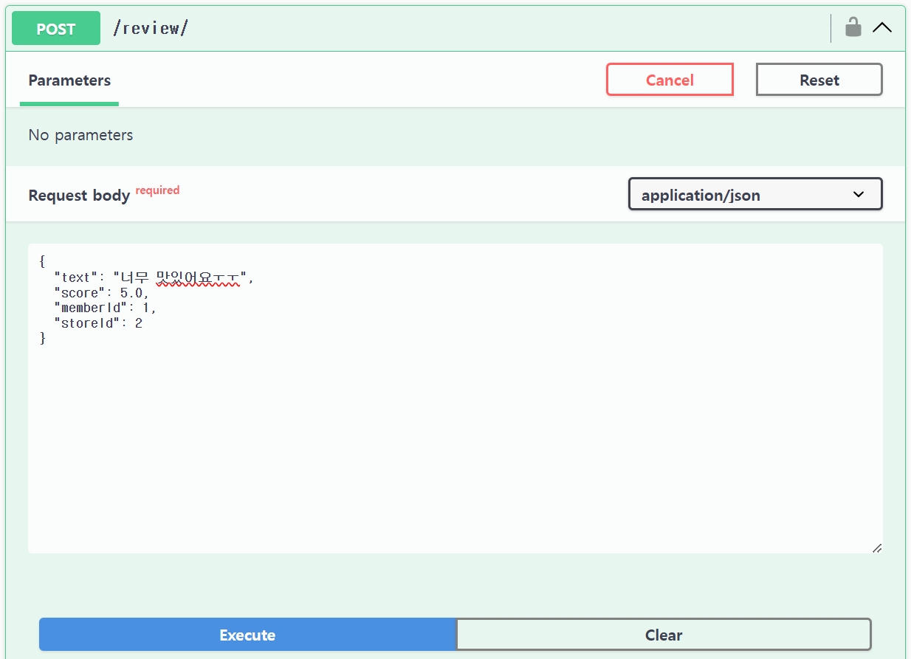
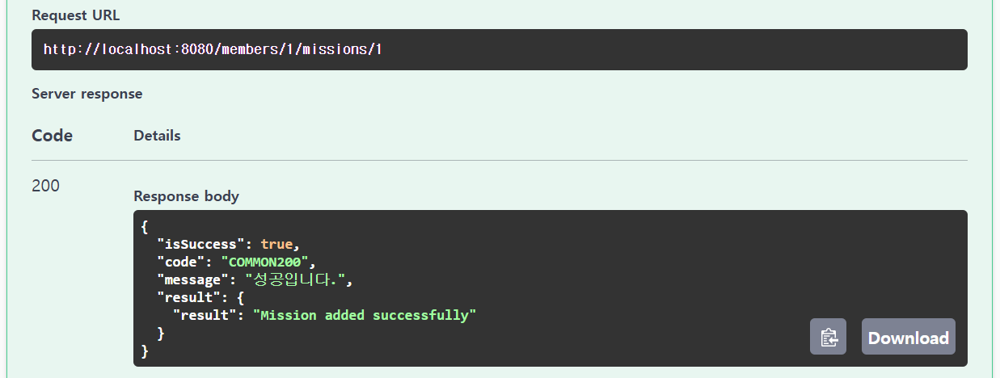

### 1. 특정 지역에 가게 추가하기 API

 

### 2. 가게에 리뷰 추가하기 API

 

### 3. 가게에 미션 추가하기 API

코드는 전부 알맞게 구현했다고 판단되는데, Swagger를 통해서 보려고 하면 반영이 안되는 문제점이 있습니다. 
잘못된 부분이 있으니 안되는거라고 생각해서 정말 오랫동안 계속 봤으나, 문제를 찾지 못하여 스터디원에게 조언도 구해 스터디 이후에는 꼭 해결해서 추가하겠습니다.

 

### 4. 가게의 미션을 도전 중인 미션에 추가(미션 도전하기) API

