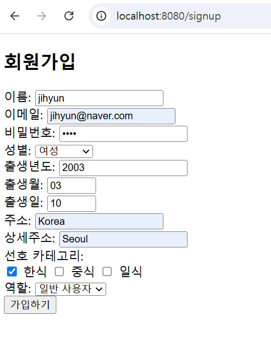
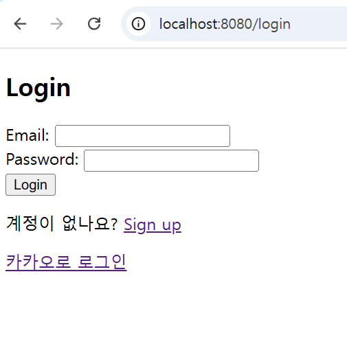

### 1. 실습 1 : Spring Security를 활용한 로그인 및 회원가입 구현

- **회원가입**

회원가입 화면에서 데이터를 입력하면, 인텔리제이 로그를 통해 데이터베이스에 성공적으로 회원 정보가 저장되었음을 확인 가능.

- **데이터베이스 확인 - member 테이블**

비밀번호가 암호화되어 저장된 것을 확인 가능.

- **데이터베이스 확인 - member_prefer 테이블**

- **로그인**

회원가입 화면에서 가입하기 버튼을 누르면, 로그인 화면으로 이동.

- **홈 페이지**

회원가입한 계정으로 로그인을 하면, 로그인이 성공하여 홈페이지로 이동. 
로그아웃 버튼을 누르면, `/login?logout` 페이지로 이동.

 
 

### 2. 실습 2 : OAuth2를 이용한 카카오톡 소셜 로그인 구현

- **카카오 로그인**

카카오로 로그인 버튼을 누르면, 개인정보 동의 화면으로 이동.

- **홈 페이지**

동의 후 계속하기 버튼을 누르면, 로그인이 성공하고 홈 페이지로 리다이렉트. 
`이름 + @kakao.com` 으로 임시 이메일 지정. 
로그아웃 버튼을 누르면, `/login?logout` 페이지로 이동.

- **데이터베이스 확인 - member 테이블**

